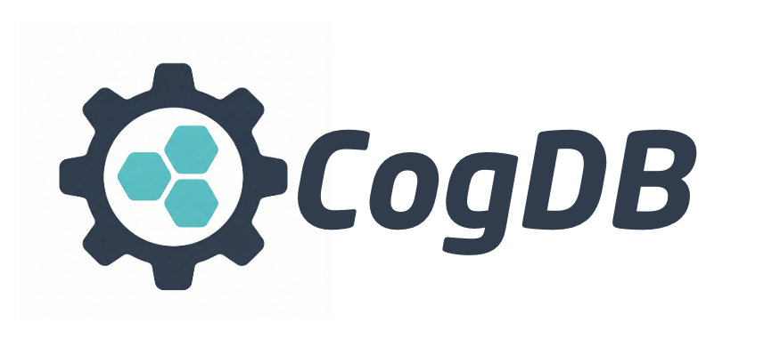
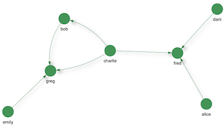
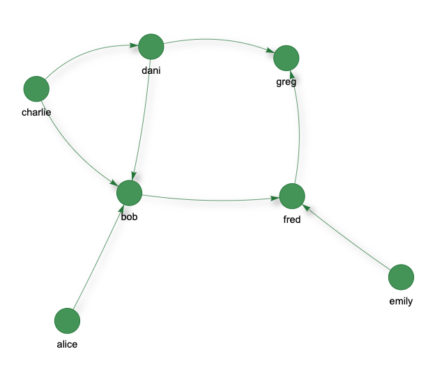
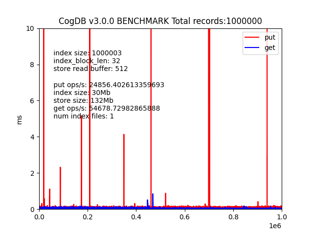

 [](https://badge.fury.io/py/cogdb) 
 [](https://travis-ci.org/arun1729/cog) [](https://opensource.org/licenses/MIT) [](https://codecov.io/gh/arun1729/cog)

# 
# CogDB - Micro Graph Database for Python Applications
> Documents and examples at [cogdb.io](https://cogdb.io)

> New release: 3.0.5
> - New word embeddings API
> - Similarity filtering using word embeddings
> - Filter step



## Installing Cog
```
pip install cogdb
```
CogDB is a persistent, embedded graph database library implemented purely in Python.  Torque is CogDB's graph query language, it is implemented as a Python API. CogDB is an ideal choice if you need a database that is easy to use and that has no setup overhead. All you need to do is to import it into your Python application. CogDB can be used interactively in an IPython environment like Jupyter notebooks.

CogDB is a triple store; it models data as `vertex edge vertex` or in other words `subject predicate object`. Triples are a serialization format for RDF. See [Wikipedia](https://en.wikipedia.org/wiki/N-Triples), [W3C](https://www.w3.org/TR/n-triples/) for details. 
and generally graph databases that model graphs this way are known as RDF databases. CogDB is inspired by RDF databases, but it does not follow a strict RDF format.

### Creating a graph

#### Using `put` to insert triples

```python
from cog.torque import Graph
g = Graph("people")
g.put("alice","follows","bob")
g.put("bob","follows","fred")
g.put("bob","status","cool_person")
g.put("charlie","follows","bob")
g.put("charlie","follows","dani")
g.put("dani","follows","bob")
g.put("dani","follows","greg")
g.put("dani","status","cool_person")
g.put("emily","follows","fred")
g.put("fred","follows","greg")
g.put("greg","status","cool_person")
g.put("bob","score","5")
g.put("greg","score","10")
g.put("alice","score","7")
g.put("dani","score","100")
```

#### Drop Edge ###

```python
g.drop("bob", "follows", "fred")
```

#### Using `putj` to insert JSONs

```python
f = Graph("followers")
f.putj('{"name" : "bob", "status" : "cool_person", "follows" : ["fred", "dani"]}')
f.putj('{"_id":  "1", "name" : "fred", "status" : "cool_person", "follows" : ["alice", "greg"]}')
```

#### Using `updatej` to update JSONs
```python
g.updatej('{"_id" : "1", "status" : "not_cool"}')
```

### Torque query examples

#### Scan vertices
```python
g.scan(3)
```

> {'result': [{'id': 'bob'}, {'id': 'emily'}, {'id': 'charlie'}]}

#### Scan edges
```python
g.scan(3, 'e')
```
>{'result': [{'id': 'status'}, {'id': 'follows'}]}

#### Starting from a vertex, follow all outgoing edges and list all vertices
```python
g.v("bob").out().all()
```
> {'result': [{'id': '5'}, {'id': 'fred'}, {'id': 'cool_person'}]}

#### Everyone with status 'cool_person'
```python
g.v().has("status", 'cool_person').all()
```

> {'result': [{'id': 'bob'}, {'id': 'dani'}, {'id': 'greg'}]}

#### Include edges in the results
```python
g.v().has("follows", "fred").inc().all('e')
```
> {'result': [{'id': 'dani', 'edges': ['follows']}, {'id': 'charlie', 'edges': ['follows']}, {'id': 'alice', 'edges': ['follows']}]}

#### starting from a vertex, follow all outgoing edges and count vertices
```python
g.v("bob").out().count()
```
> '3'

#### See who is following who and create a view of that network
#### Note: `render()` is supported only in IPython environment like Jupyter notebook otherwise use view(..).url.
By tagging the vertices 'from' and 'to', the resulting graph can be visualized.
```python
g.v().tag("from").out("follows").tag("to").view("follows").render()

```

# 

```python
g.v().tag("from").out("follows").tag("to").view("follows").url

```
> file:///Path/to/your/cog_home/views/follows.html

#### List all views 
```
g.lsv()
```
> ['follows']

#### Load existing visualization
```
g.getv('follows').render()
```

#### starting from a vertex, follow all out going edges and tag them

```python
g.v("bob").out().tag("from").out().tag("to").all()
```
> {'result': [{'from': 'fred', 'id': 'greg', 'to': 'greg'}]}
> 

#### starting from a vertex, follow all incoming edges and list all vertices
```python
g.v("bob").inc().all()
```
> {'result': [{'id': 'alice'}, {'id': 'charlie'}, {'id': 'dani'}]}

#### Filtering

```python
g.v().filter(func=lambda x: x.startswith("d")).all()
```
> {'result': [{'id': 'dani'}]}


```python
g.v().out("score").filter(func=lambda x: int(x) > 5).inc().all()
```
> {'result': [{'id': 'alice'}, {'id': 'dani'}, {'id': 'greg'}]}

```python
g.v("emily").out("follows").filter(func=lambda x: x.startswith("f")).all()
```
> {'result': [{'id': 'fred'}]}


#### json example

```python
#### Using `putj` to insert JSONs
f = Graph("followers")
f.putj('{"name" : "bob", "status" : "cool_person", "follows" : ["fred", "dani"]}')
f.putj('{"name" : "fred", "status" : "cool_person", "follows" : ["alice", "greg"]}')
```

```python 
f.v().has('name','bob').out('follows').all()
```

> {'result': [{'id': 'dani'}, {'id': 'fred'}]}

```python
f.v().has('name','fred').out('follows').all()
```

> {'result': [{'id': 'greg'}, {'id': 'alice'}]}

In a json, CogDB treats `_id` property as a unique identifier for each object. If `_id` is not provided, a randomly generated `_id` is created for each object with in a JSON object.
`_id` field is used to update a JSON object, see example below.

## Using word embeddings

CogDB supports word embeddings. Word embeddings are a way to represent words as vectors. Word embeddings are useful for many NLP tasks. 
There are various types of word embeddings, including popular ones like [GloVe](https://nlp.stanford.edu/projects/glove/) and [FastText](https://fasttext.cc/).

#### Add a word embedding:

```python
g.put_embedding("orange", [0.1, 0.2, 0.3, 0.4, 0.5])
```

#### Get a word embedding:

```python
g.get_embedding("orange")
```

> [0.1, 0.2, 0.3, 0.4, 0.5]
#### Delete a word embedding:

```python
g.delete_embedding("orange")
```

#### Use word embeddings in a query:

```python 
g.v().sim('orange', '>', 0.35).all()
```
> {'result': [{'id': 'clementines'}, {'id': 'tangerine'}, {'id': 'orange'}]}

```python
g.v().sim('orange', 'in', [0.25, 0.35]).all()
```
> {'result': [{'id': 'banana'}, {'id': 'apple'}]}

In the above code, the sim method is used to filter vertices based on their cosine similarity with the word embedding for "orange". The operator and threshold arguments determine how the similarity is compared to the threshold value, which can be a single value or a range.

## Loading data from a file

### Create a graph from CSV file

```python
from cog.torque import Graph
g = Graph("books")
g.load_csv('test/test-data/books.csv', "book_id")
```
#### Get the names of the books that have an average rating greater than 4.0
```python
g.v().out("average_rating", func=lambda x: float(x) > 4.0).inc().out("title").all()
```

#### Triples file

CogDB can load a graph stored as N-Triples, a serialization format for RDF. See [Wikipedia](https://en.wikipedia.org/wiki/N-Triples), [W3C](https://www.w3.org/TR/n-triples/) for details. 

In short, an N-Triple is sequence of subject, predicate and object in a single line that defines a connection between two vertices:

  ```vertex <predicate> vertex```

[Learn more about RDF triples](https://www.w3.org/TR/rdf-concepts/#:~:text=An%20RDF%20triple%20contains%20three,literal%20or%20a%20blank%20node)

```python
from cog.torque import Graph
g = Graph(graph_name="people")
g.load_triples("/path/to/triples.nt", "people")
```

#### Edgelist file
```python
from cog.torque import Graph
g = Graph(graph_name="people")
g.load_edgelist("/path/to/edgelist", "people")
```

## Config

If no config is provided when creating a Cog instance, it will use the defaults:

```
COG_PATH_PREFIX = "/tmp"
COG_HOME = "cog-test"
```

### Example updating config

```python
from cog import config

config.COG_HOME = "app1_home"
data = ('user_data:id=1', '{"firstname":"Hari","lastname":"seldon"}')
cog = Cog(config)
cog.create_or_load_namespace("test")
cog.create_table("db_test", "test")
cog.put(data)
scanner = cog.scanner()
for r in scanner:
 print
 r

```

## Benchmark

# 
